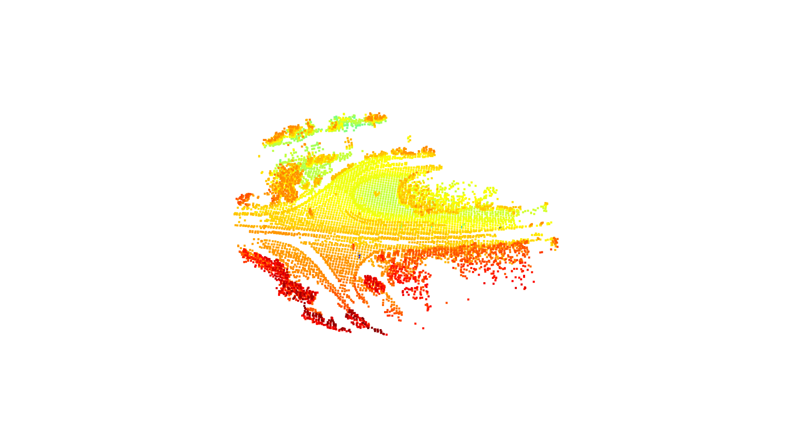
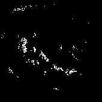
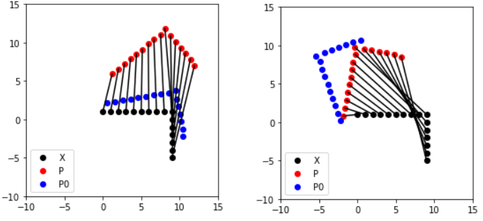
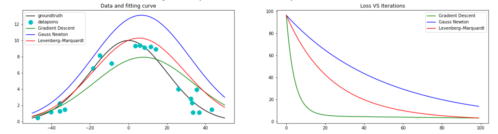
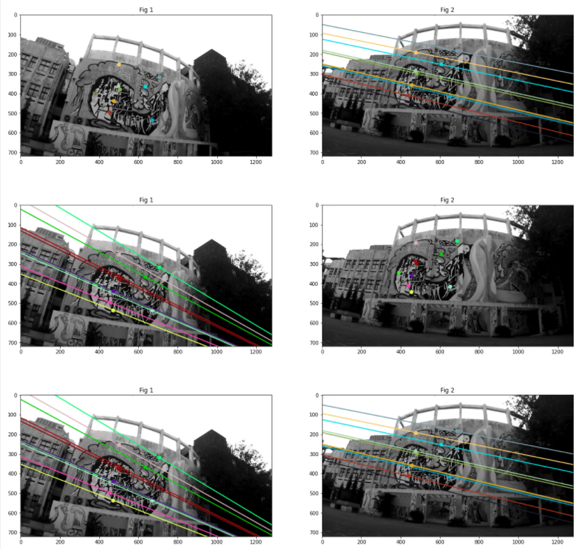
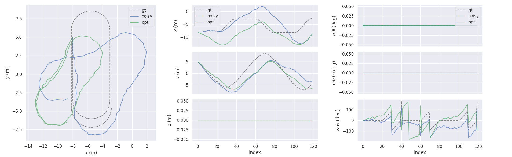
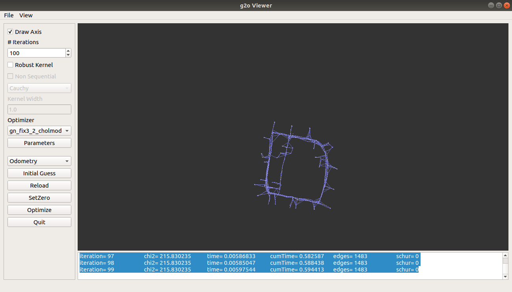
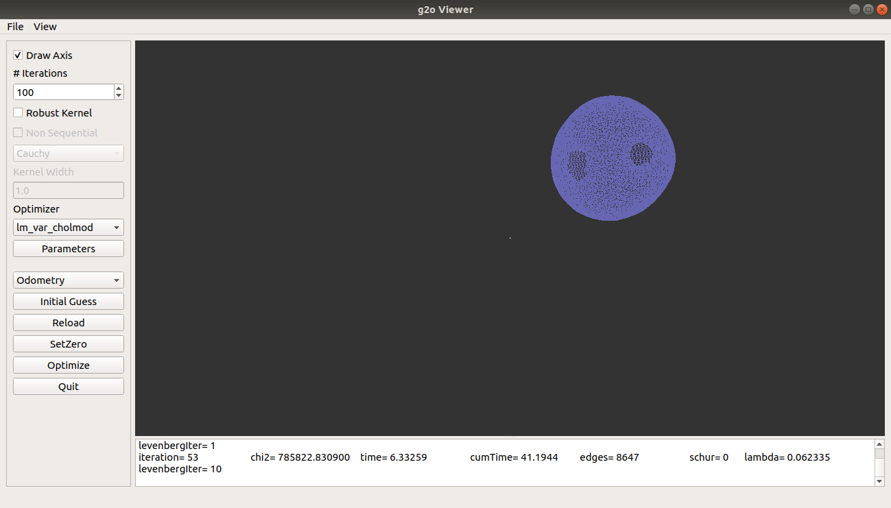
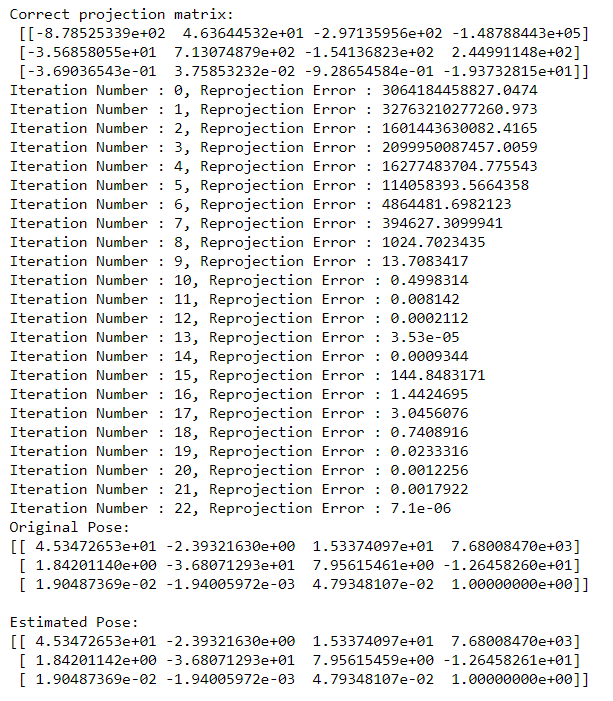

# Mobile Robotics

## Assignment 1 - 
1. Converting RGBD image into Point Cloud.

2. Rotations, Euler angles and Gimbal Lock

## Assignment 2 -
1. Point Cloud Registration

2. Occupancy Grid Construction

## Assignment 3 -
1. Iteractive Closest Point

2. Non-linear least squares optimization

## Assignment 4 -
1. Camera Calibration - Direct Linear Transform(DLT), Zhang's Method
2. Epipolar Lines

# Project 
## Project 1 - Pose Graph Optimization 
1. Pose Graph Optimization for 2D SLAM

2. Optimizing intel and sphere datasets using G2O

## Project 2 - 
1. Stereo dense reconstruction

2. Motion estimation using iterative PnP

